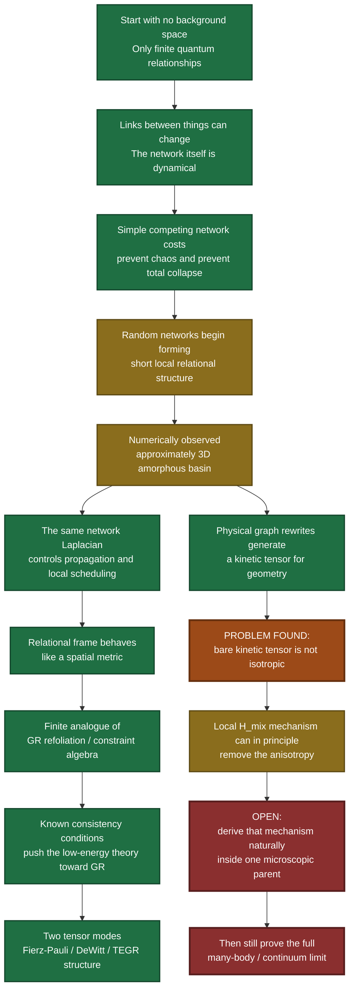
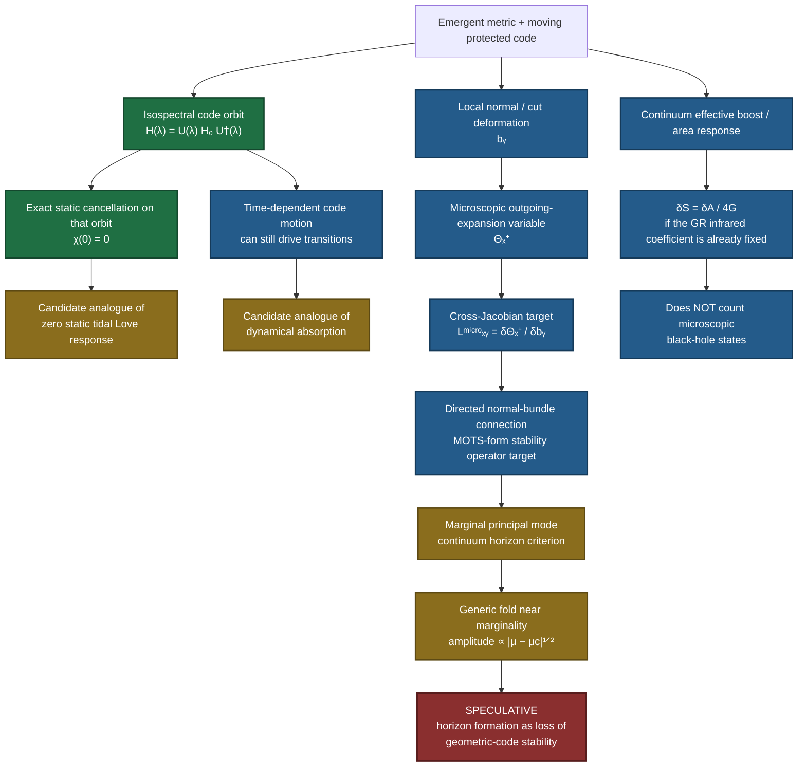

# GWXP — The Layman’s Guide

> **What is this?**  
> An AI-assisted independent research project exploring whether space and gravity could emerge from a finite quantum network rather than being fundamental ingredients of the universe.
>
> **What is it not?**  
> It is **not** a proven theory of quantum gravity, not a peer-reviewed result, and not a claim that Einstein has been replaced. The repository contains a mixture of exact finite mathematics, numerical experiments, failed ideas, corrected mistakes, and a small number of genuinely difficult open questions.

---

## The 30-second version

The project started with a fairly loose question:

> **What if the universe has a finite amount of quantum “room”, and what we experience as space and gravity somehow emerges from how that finite information is organised?**

That original idea turned out to be too vague and, in several forms, wrong.

What survived was a much more technical question:

> **Can a finite network of quantum relationships reorganise itself into something that behaves like three-dimensional space, while also producing the very specific mathematical structure that gravity requires?**

The surprising part is that a number of pieces that initially looked unrelated can be made to fit together in finite models.

The equally important part is that the project **did not close the whole loop**. The strongest current candidate still fails one important graviton-symmetry test unless an additional local mechanism (`H_mix`) does real work. We found that the required correction is mathematically available, but we have **not derived the microscopic rule that naturally produces it**.

That is where the project has been paused for specialist review.

---

## The whole idea in one picture



The key point is that the project is **not** “I made a graph that looks vaguely like space”. The target became much stricter: the same finite system has to produce geometry, the right gravitational degrees of freedom, the right local gauge/refoliation structure, and the same effective metric in all of those places.

---

# How this started

This did **not** begin as a formal academic research programme.

It began as a weekend thought experiment using language models and Python.

The opening intuition was roughly:

> Maybe spacetime is not an infinitely divisible physical substance. Maybe it is the visible, large-scale description of a finite quantum information system. If matter consumes or rearranges some underlying information capacity, perhaps gravity could be the system’s response.

That sounded interesting, but it was not yet physics. It was mostly a metaphor.

The first phase of the project therefore became an exercise in trying to **kill the metaphor**.

Several attractive ideas were discarded:

- “matter uses up space” as a literal scalar capacity rule;
- physical Planck-sized pixels of space;
- information amount itself acting as gravitational charge;
- a simple local capacity percentage acting as the metric;
- the idea that finite local Hilbert-space size automatically determines Newton’s constant;
- simplistic black-hole response models;
- several overly rigid lattice and commuting-projector constructions.

The project gradually stopped being about an “information shortage” and became about something much narrower:

> **Can a finite quantum many-body system naturally enter the same kind of constrained phase that general relativity requires?**

That is the version represented by this repository.

---

# Why graphs entered the picture

If you do not assume space already exists, you cannot begin by placing quantum objects at coordinates like `(x,y,z)`.

You need something more primitive.

The simplest choice is a **relationship network**:

- nodes represent finite quantum subsystems or relational sites;
- links represent active relationships;
- the pattern of links is allowed to change;
- there is no external coordinate system telling the graph what “nearby” means.

This gives a very concrete question:

> Can a completely relational graph, starting without coordinates, reorganise so that its large-scale behaviour looks like a low-dimensional space?

That became the geometry part of GWXP.

---

# The graph-selection idea in normal English

The current graph energy contains several competing pressures.

Very loosely:

- **valence pressure** prefers roughly six links per node;
- **triangle frustration** discourages immediate tiny cliques;
- **communicability** rewards useful short routes and repeated relational structure;
- **capacity** prevents all of those routes from piling through the same channels;
- a **spectral/global term** cares about the graph’s long-distance connectivity.

None of those terms explicitly says:

> “make a 3D lattice.”

There are no hidden `(x,y,z)` coordinates in the authoritative autonomous runs, and there is no term that literally rewards “dimension = 3”.

The hope was that the competition between these simple pressures could produce a network that sits between two bad extremes:

```text
random expander-like graph
        ↕
   desired local geometry
        ↕
rigid / over-crystalline graph
```

Numerically, that appears to happen in the tested finite systems.

At the current parameter point, independently generated coordinate-free graphs at sizes `N=128`, `216`, and `344` moved into relation-rich states with spectral-dimension diagnostics around three and lower energy than the structured Abelian/Cayley competitors tested at the same sizes.

That is evidence for a candidate phase.

It is **not** a proof that the infinite system is three-dimensional.

---

# Why “three dimensions” is only part of the problem

Even if the graph genuinely became three-dimensional, that alone would not give us gravity.

A lot of speculative models can make something geometry-like.

General relativity is much more restrictive.

At low energy, a gravitational theory needs, among other things:

- the correct physical degrees of freedom;
- exactly two massless tensor polarisations for the graviton;
- no unwanted low-energy scalar or vector geometry;
- a local notion of spatial metric;
- a very particular relationship between “evolving forward” and “moving sideways”;
- gauge/refoliation freedom rather than a preferred universal slicing;
- the same metric controlling matter propagation and the gravitational constraint algebra.

That is why most of the project ended up being about **constraints and algebra**, not pictures of graphs.

---

# One of the most interesting findings: GR becomes very rigid once you ask for the right structure

A repeated theme in the project was that once certain gravitational consistency conditions are imposed, there is much less freedom than expected.

Within the assumptions tested here:

- preserving the linearised constraint structure forces the spatial operator toward the **Fierz–Pauli / linearised Einstein** form;
- preserving the scalar constraint selects the familiar **DeWitt** trace combination;
- a related frame/torsion calculation selects the **TEGR** coefficient ratio.

In other words, the project increasingly stopped asking:

> “Can I invent Einstein’s equations from scratch?”

and instead asked:

> “Can the microscopic system naturally produce the symmetry and constraint structure that makes Einstein-like dynamics almost unavoidable?”

That shift is one of the main conceptual outcomes of the project.

---

# The refoliation problem, in plain English

General relativity does not have one sacred way to slice spacetime into “space now, space later”.

Different local choices of slicing can describe the same physics.

Mathematically, doing two local “normal” deformations in different orders produces a spatial displacement. This is part of the **hypersurface-deformation algebra**.

GWXP constructed finite update systems where the same qualitative relationship occurs:

```text
normal update × normal update
        ↓
spatial transformation
```

and where the amount of spatial transformation depends on the same relational frame that behaves like the inverse spatial metric.

This is an **exact finite algebraic construction** in the tested models.

The important limitation is that constructing the algebra is not the same thing as proving that an enormous interacting many-body Hamiltonian naturally enters a phase where those generators are genuine first-class constraints.

That larger integration theorem remains open.

---

# Why the graph has to be able to move quantum mechanically

A major correction late in the project was recognising that the optimisation algorithm was not the physics.

Originally, many tests effectively did this:

```text
propose graph change
        ↓
if energy decreases, keep it
```

That is useful for exploring an energy landscape, but the universe is not a zero-temperature Python optimiser.

The actual candidate therefore needs a **Hermitian quantum transition amplitude** between graph configurations.

A gapped relational mediator was constructed whose finite downfolding produces a symmetric transition amplitude between legal degree-preserving graph rewrites.

That gave a genuine candidate quantum configuration-space Hamiltonian:

```text
H_total ≈ graph energy + quantum graph hopping
```

Small exact sectors of that combined Hamiltonian were then diagonalised.

At weak-to-moderate hopping strength, the quantum ground state stayed concentrated on the lower-energy, relation-rich side rather than immediately washing back into generic expander-like graphs.

That is a useful consistency result, but again only at finite size.

---

# The most important failure we found

This is probably the single most important thing for a casual reader to know:

> **The current model does not automatically produce perfectly isotropic graviton kinetics.**

The graph can be amorphous and look approximately isotropic at the ordinary metric level while still retaining a subtler fourth-order directional grain in the kinetic tensor governing geometry changes.

When the corrected physical kinetic tensor was measured, the residual anisotropy was approximately:

```text
N=128 : 0.249
N=216 : 0.387
N=344 : 0.499
```

So the hopeful earlier idea that “random-looking geometry will automatically average this away” was wrong in the tested states.

This result is deliberately preserved because it is exactly the kind of thing that should be visible in an honest research notebook.

---

# The proposed rescue: `H_mix`

The candidate architecture already contained a local schedule/frustration sector called `H_mix`.

Its job is to penalise directional, non-scalar components of the local geometry-change statistics.

In normal language:

> If a neighbourhood has too strong a preference for changing shape along particular directions, the local dynamics should frustrate those rewrite channels until the effective large-scale response becomes rotationally neutral.

The first version of this test looked better than it really was. A radius-3 optimisation could sometimes satisfy the isotropy equations simply by suppressing almost all local shear motion — mathematically “isotropic”, but physically useless.

After that loophole was removed:

- radius 3 was **not** robust;
- radius-4 local move cones **did** contain exactly isotropic solutions with substantial non-zero kinetic strength;
- those solutions can remain reasonably close to the physical mediator-weighted prior overall, although a small number of rare channels sometimes require large enhancement.

So the present status is:

> **Local isotropisation is geometrically possible, but the microscopic Hamiltonian that naturally selects those weights has not been derived.**

That is probably the cleanest single technical problem to hand to an expert.

---

# The matter side

The same graph incidence operator naturally gives a finite `z=1` propagation branch — the discrete analogue of a relativistic linear dispersion relation.

But there is a catch.

Graph edge degrees of freedom contain a large number of cycle-like zero modes that are not wanted as physical massless matter modes.

The repair is a local “curl” penalty built from polygonal cycles of the graph.

An early claim that cycles up to length 7 were always enough turned out to be false: the autonomous `N=344` state needed length-8 loops to span its whole cycle space.

The hard cutoff was therefore removed and replaced with a **soft hierarchy of local loop penalties**.

For the tested finite systems, the unwanted cycle sector remains gapped rather than collapsing toward zero.

That is a finite-size success.

Whether that gap stays nonzero at arbitrarily large size remains open.

---

# What may actually be novel here?

This section needs to be read carefully.

**Nothing in this repository has an established priority claim simply because it was generated here.** The work has not undergone an exhaustive literature comparison or peer review, and emergent gravity, quantum graphity, relational spacetime, tensor networks, discrete gravity, quantum error correction, and finite models of gauge structure all have substantial existing literatures.

So “novel” below means **apparently distinctive within this project and worth expert comparison**, not “proven to have never appeared before”.

The potentially interesting combination is not any single buzzword. It is the attempt to make the **same finite relational structure** perform many jobs at once:

1. a graph-only energy landscape that can autonomously form a low-dimensional amorphous basin;
2. the same incidence/Laplacian structure controlling propagation and schedule commutators;
3. exact finite precursors of the normal-normal gravitational bracket;
4. a direct identity linking graph rewrites to physical metric changes;
5. the effective gravitational kinetic tensor appearing as statistics of fluctuations of that same relational Laplacian;
6. finite coefficient-locking results connecting gravity and matter to a shared schedule clock;
7. a genuinely Hermitian soft-local graph-rewrite mediator rather than a hand-imposed graph-radius rule;
8. an explicit negative result showing that the bare kinetic tensor is *not* isotropic, thereby isolating exactly what an additional closure mechanism must accomplish.

If there is something scientifically valuable here, it is probably in that **integration architecture** rather than in the original “finite information causes gravity” slogan.

---

# What is still speculation?

A lot.

The following should be treated as interpretation or hypothesis, **not results**:

- that the actual universe is fundamentally a finite graph-like quantum system;
- that spacetime is literally an information ledger;
- that gravity is literally “data compression”;
- that finite information capacity is the physical reason gravity exists;
- that the specific graph energy used here is realised by nature;
- that the candidate phase survives to the true thermodynamic limit;
- that Standard Model particles emerge from this construction;
- that black holes or cosmology are already explained by GWXP;
- that the project constitutes a complete theory of quantum gravity.

The colourful “cosmic ledger / compression” language is best understood as the **intuition that originally motivated the search**, not the conclusion of the mathematics.

---

# The speculative black-hole branch, visually

GWXP also explored whether the same moving relational/code language could say anything useful about black-hole response.

This branch is **not part of the core evidence for the graph phase**, and it is **not a derivation of Schwarzschild or Kerr black holes**. Some steps below are exact finite or structural statements; the identification with real black-hole physics is still conditional or speculative.



The strongest statement here is therefore **structural**, not phenomenological: a moving-code construction can give exact zero static response on an isospectral orbit while retaining dynamical response, and the correct microscopic analogue of a generic horizon-stability operator should be a directed deformation-to-expansion Jacobian rather than an ordinary symmetric susceptibility. Whether the autonomous GWXP parent actually generates the required black-hole sector remains open.

---

# What has actually been shown inside the project?

There are several different evidence levels in the repository.

### Exact / constructive finite results

These are algebraic statements or finite constructions that can be checked directly under their stated assumptions.

Examples include:

- degree-sector valence selection;
- the incidence identity connecting the graph Laplacian to the edge/vertex structure;
- finite schedule commutators with the expected antisymmetric lapse structure;
- finite moving-graph Jacobi checks;
- the exact identity connecting a graph rewrite to a metric rewrite;
- finite Fierz–Pauli / DeWitt / TEGR rigidity calculations under their stated hypotheses;
- a finite gapped mediator whose elimination produces the corrected Hermitian graph-hopping kernel.

### Numerical evidence

These are reproducible finite computations, not theorems.

Examples include:

- autonomous low-dimensional graph formation at `N=128,216,344`;
- beating the tested rank-1/2/3 Abelian/Cayley competitors at the current parameter point;
- finite combined graph-energy + quantum-hopping ground-state tests;
- finite matter curl gaps;
- radius-4 local isotropic kinetic witnesses.

### Failed / corrected claims

These are retained deliberately.

Examples include:

- early radius-3 graph accessibility tests contained a hidden locality filter;
- some early “3-switch” proposals were actually reducible to ordinary 2-switches plus spectators;
- the old common-graph mediator freezes too strongly with system size;
- a square-root mediator kernel was heuristic and was replaced by the product kernel from an explicit construction;
- classical downhill optimisation is not the model’s quantum dynamics;
- bare amorphous geometry does **not** automatically remove the spin-4 kinetic anisotropy;
- the old robust radius-3 `H_mix` claim did not survive a stronger test;
- a universal hard cycle cutoff at length 7 is false.

The file [`04) Known Issues and Corrections - 2026-09-29.md`](04%29%20Known%20Issues%20and%20Corrections%20-%202026-09-29.md) exists specifically so none of these corrections are buried.

---

# The current model in one line

The frozen candidate is schematically:

```text
H_total
 = graph-selection energy
 + soft quantum graph-rewrite mediator
 + local schedule / incidence sector
 + rotational closure sector H_mix
 + matter / local-cell sector.
```

Or even more simply:

```text
Which networks are energetically preferred?
        +
Which network changes are quantum-mechanically allowed?
        +
How does the network define local clocks / slices?
        +
How are directional inconsistencies suppressed?
        +
How does matter propagate on the same structure?
```

The goal is for all five answers to come from **one finite relational parent**, rather than writing GR into the model afterwards.

---

# Why six links per node?

The current graph phase is centred on degree 6.

This is a microscopic model choice in the present candidate, not something the project has derived from a deeper principle.

Degree 6 is attractive because it is the natural coordination number of a simple cubic three-dimensional lattice and gives enough local directions for the tested metric/frame constructions, but GWXP does **not** currently prove that six is uniquely selected by fundamental physics.

That is an example of the distinction this repository tries to preserve between:

```text
ASSUMED
DERIVED
NUMERICALLY OBSERVED
INTERPRETED
```

---

# Why the project stopped here

The easy answer would be “because it got too hard”.

The more useful answer is that the nature of the remaining problems changed.

Earlier questions could be attacked with:

- exact finite algebra;
- modest matrix calculations;
- graph searches;
- Monte Carlo / local descent;
- small exact diagonalisation;
- convex optimisation;
- adversarial numerical tests.

Those have now been pushed far enough to expose the real bottlenecks.

The remaining questions are things like:

1. Does the approximately-3D graph phase remain stable in the true large-system limit against a much broader adversary class?
2. Can a specific **local microscopic** `H_mix` Hamiltonian naturally generate the required isotropic gravitational kinetic tensor without fitting weights by hand?
3. Does the **same assembled many-body parent** really possess genuine first-class scalar and spatial constraints?
4. Are all unwanted scalar/vector modes gapped in that full phase?
5. Does the continuum limit close nonlinearly onto GR/TEGR rather than merely reproducing several of its finite algebraic shadows?

Those are not well answered by simply running another random Python search overnight.

They need people who work professionally in areas like:

- mathematical relativity;
- constrained Hamiltonian systems;
- quantum gravity;
- spectral graph theory;
- quantum many-body theory;
- lattice/discrete gauge systems;
- rigorous numerical phase analysis.

That is why this snapshot is called **pre-handoff complete**, not theory-complete.

---

# What would count as a big win?

A strong next-stage result would be something like:

> Starting from one explicit finite local Hamiltonian, prove or robustly demonstrate a thermodynamic phase in which the graph becomes approximately three-dimensional, the same emergent metric controls propagation and refoliation, the local constraint algebra is first-class, the physical kinetic tensor becomes isotropic without fitted global weights, and only two massless tensor modes survive.

At that point the claim would become much stronger than “interesting finite toy structures”.

It would still require continuum and phenomenological work, but the central emergence mechanism would be substantially closed.

---

# What would kill the project?

A clean failure is preferable to adding rescue terms forever.

GWXP should be considered seriously damaged if robust work shows that:

- the apparent 3D basin disappears at larger sizes or against better competitors;
- the model only finds low-dimensional geometry when coordinates or locality are secretly supplied;
- the required `H_mix` isotropy cannot arise from a genuinely local microscopic rule;
- the matter curl gap collapses with size;
- the finite schedule algebra cannot become a genuine first-class many-body redundancy;
- extra massless scalar/vector modes survive;
- or the only way to obtain closure is to insert GR’s constraint tensors directly into the microscopic Hamiltonian.

Those are genuine falsification conditions, not rhetorical caveats.

---

# How much of this was done with AI?

A lot.

Language models were used extensively for:

- generating and checking algebraic derivations;
- writing and debugging Python;
- suggesting falsification tests;
- identifying inconsistencies between different parts of the model;
- searching for alternative mechanisms;
- organising a very large research notebook;
- producing the handoff documentation.

That should increase caution, not decrease it.

A language model saying an equation is correct is **not independent verification**.

Likewise, AI-generated code reproducing an expected number is not peer review.

For that reason the repository preserves:

- failed routes;
- contaminated runs;
- superseded formulas;
- negative results;
- explicit evidence labels;
- reproducible scripts and raw finite outputs.

See [`06) AI Assistance Disclosure.md`](06%29%20AI%20Assistance%20Disclosure.md) for the formal disclosure.

---

# Can I trust the headline results?

You can trust that the repository is intended to be an honest record of what the current scripts and derivations say.

You should **not** treat that as the same thing as independent scientific validation.

The right confidence levels are roughly:

```text
Exact finite identity        → checkable directly
Finite numerical result      → reproducible but finite
Physical interpretation      → arguable
Thermodynamic extrapolation  → open
Theory of nature             → speculative
```

The package includes a lightweight test runner that recomputes several authoritative graph energies and checks the saved headline results, but an expert should still audit the code and mathematics independently.

---

# If you only want the interesting bits

Here is the short version I would tell you over lunch:

1. I started wondering whether space could emerge from finite quantum information rather than being fundamental.
2. Most of that original idea got killed.
3. The surviving version became a concrete graph/many-body model with no background coordinates.
4. The graph energy does appear to autonomously produce finite states with roughly three-dimensional behaviour.
5. Several exact finite constructions reproduce pieces of the very unusual gauge/refoliation algebra used by general relativity.
6. Once that structure is assumed, independent consistency calculations keep forcing the low-energy theory toward familiar GR forms.
7. A genuine quantum mechanism for local graph rewrites can be constructed without hard-coding a graph-distance cutoff.
8. Then the project hit a real wall: the physical graviton kinetic tensor is still directionally anisotropic.
9. A local correction mechanism can mathematically fix that at radius 4, but I have not derived why the underlying quantum system would naturally choose those corrected weights.
10. That is where I stopped pretending brute-force AI/Python work was the right tool and froze the project for external review.

---

# Where should I click next?

If you are **not a physicist**, I would read in this order:

1. **This file** — `01) The Laymans Guide.md`
2. [`02) Project Status - 2026-09-29.md`](02%29%20Project%20Status%20-%202026-09-29.md) — one-page technical claim ledger
3. [`04) Known Issues and Corrections - 2026-09-29.md`](04%29%20Known%20Issues%20and%20Corrections%20-%202026-09-29.md) — the mistakes and negative results
4. [`docs/01) Frozen Candidate Parent - 2026-09-29.md`](docs/01%29%20Frozen%20Candidate%20Parent%20-%202026-09-29.md) — the actual frozen model
5. [`docs/02) Pre-Handoff Final Pass - 2026-09-29.md`](docs/02%29%20Pre-Handoff%20Final%20Pass%20-%202026-09-29.md) — what happened in the final tests

If you **are** a physicist or graph theorist, start with the frozen candidate, evidence ledger, known issues, and reproducibility notes.

If you want to **rerun things**, see [`05) Reproducibility Guide.md`](05%29%20Reproducibility%20Guide.md) and [`scripts/`](scripts/).

---

# Mini glossary

**Graph**  
A collection of nodes and links. Here the graph is not sitting *inside* space; the hope is that something space-like emerges from the graph itself.

**Hamiltonian**  
The mathematical object that determines energy and quantum dynamics.

**Laplacian**  
A matrix built from the graph that describes how quantities spread or diffuse across it. In GWXP the same object unexpectedly appears in several sectors.

**Spectral dimension**  
A way of estimating effective dimension by asking how diffusion behaves. It need not equal an ordinary embedding dimension.

**Graviton**  
The hypothetical quantum excitation of the gravitational field. In ordinary 3+1-dimensional GR it has two physical tensor polarisations.

**Gauge redundancy**  
Different mathematical descriptions representing the same physical state.

**Refoliation**  
The freedom in GR to describe spacetime using different choices of spatial slices without changing the underlying physics.

**HDA / hypersurface-deformation algebra**  
The algebra describing how different local spatial and normal deformations combine in general relativity.

**Fierz–Pauli**  
The standard consistent linear theory of a massless spin-2 field.

**DeWitt metric**  
The characteristic kinetic structure on the space of spatial metrics in canonical GR.

**TEGR**  
The teleparallel equivalent of general relativity — a formulation using torsion rather than the usual curvature description.

**Spin-4 anisotropy**  
A higher-order directional grain that can survive even when the ordinary rank-2 metric already looks isotropic. This is the present technical wall.

**`H_mix`**  
The placeholder name for the local dynamical sector intended to eliminate that higher-order directional grain.

**Thermodynamic limit**  
What happens as the system becomes arbitrarily large. Results at `N=128`, `216`, and `344` do not by themselves establish this limit.

---

# Final status

The fairest description of GWXP at this point is:

> **A speculative finite-relational gravity programme with several exact finite constructions, nontrivial numerical evidence for an autonomous low-dimensional graph phase, a reproducible record of failed mechanisms, and one sharply isolated graviton-isotropy / constraint-integration problem still standing between the candidate and a genuine emergent-gravity theory.**

The project is therefore:

```text
not a proof of quantum gravity
not a replacement for GR
not peer reviewed
not finished physics

but also

not just the original weekend metaphor anymore.
```

The next meaningful step is independent specialist scrutiny.
