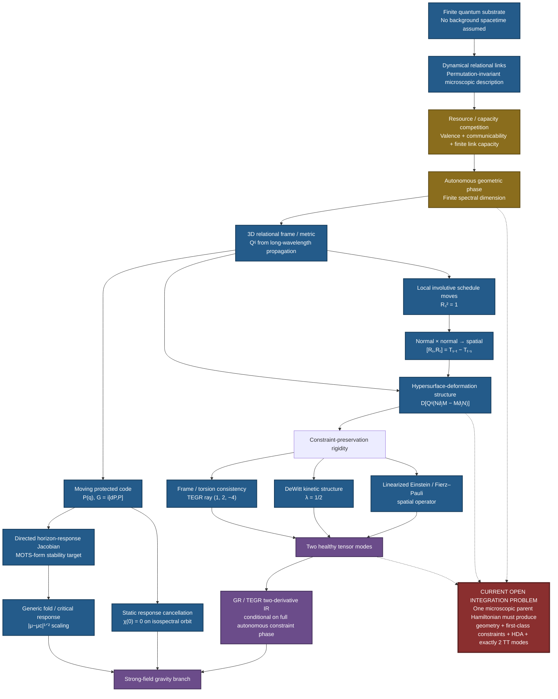

# README amendment — 29 September 2026

This file is intended to update the current GitHub README without pretending the project is finished.

## A. Updates 29/09/26 (Aussie)

```markdown
> **Status:** active research programme / pre-handoff checkpoint  
> **Current result:** GWXP now has (i) several exact finite relational / constraint constructions, (ii) a graph-only parent whose corrected energy landscape autonomously drives generic degree-6 graphs toward relation-rich low-dimensional states and has beaten tested rank-2 controls at `N=216` and `N=344`, and (iii) an exact finite construction of a gapped Hermitian pair-mediator that supplies soft relational graph-rewrite amplitudes without a hard locality cutoff.  
> **Not yet shown:** that one frozen microscopic Hamiltonian has a stable thermodynamic 3D quantum phase with the full first-class scalar/spatial constraint structure, an isotropic downfolded rank-4 kinetic tensor, exactly two healthy gapless tensor modes, and nonlinear continuum GR universality.
```

## B. Updates 29/09/26 (Aussie)

```markdown
---

## Research checkpoint — 29 September 2026

The graph-emergence branch has changed substantially since the earlier README was written.

The active graph-only working point is now approximately

```text
degree k = 6
g        = 2.0
U        = 0.100
kappa    = 0.30
epsilon  = 0.025
tau      = 5
```

At this point, parent-energy-only graph descent from generic degree-6 starts spontaneously condenses short relations, lowers the spectral gap, and moves toward an approximately three-dimensional disordered regime without being supplied coordinates or a target dimension.

A long `N=216` blind run crossed the tested rank-2 Cayley competitor while retaining approximately 3D heat-kernel behaviour. A later `N=344` run exposed an important hidden bias: an earlier proposal generator had imposed a hard relational-locality filter. After removing that filter completely, the unrestricted blind run still crossed the tested same-size rank-2 control. This is stronger evidence that the low-dimensional tendency belongs to the parent-energy landscape rather than to an externally supplied locality rule.

Several claims were also corrected rather than preserved:

- an earlier `k=3` rewire implementation included reducible `k=2 + spectator` events; strict connected higher-order swaps do not currently show a special un-jamming advantage over ordinary 2-switches;
- the old multiplicative common-graph mediator is Hermitian but appears to freeze too strongly with system size on generic graphs;
- a heuristic additive square-root mediator improves that scaling but lacks a comparably clean microscopic derivation;
- zero-temperature graph annealing is now treated as an energy-landscape diagnostic, not as the literal microscopic quantum dynamics.

The current soft-local kinetic candidate instead comes from a gapped pair mediator. Let

```text
h_G = I - rho A_G,
H_chi(G) = Delta (h_G tensor h_G),
R_G = (I-rho A_G)^(-1),
0 < rho < 1/6.
```

Eliminating the mediator gives the Hermitian graph-to-graph matrix element

```text
<G'|H_eff|G>
 = -(gamma^2 / 2 Delta) [
     R_G(a,c) R_G(b,d)
   + R_G'(a,b) R_G'(c,d)
   ].
```

This construction is coordinate-free, uses only the relational graph, has no hard `r` cutoff, and was verified by direct finite-Hamiltonian Schur reduction to machine precision.

The resulting conceptual picture is now

```text
H_graph : selects the graph-energy landscape
H_med   : supplies Hermitian soft-local motion through graph configuration space
H_sched : carries the local schedule / normal structure
H_mix   : tests / enforces the required local rotational closure structure
matter  : uses the same incidence complex
```

The next decisive test is therefore no longer “can a classical optimiser find the 3D basin?” It is whether the **combined finite quantum Hamiltonian `H_graph + H_med` has its low-energy weight concentrated on the relation-rich approximately-3D sector**, and whether the rank-4, closure, matter-gap, and thermodynamic tests survive on that same autonomous phase.

This is still a research programme, not a completed derivation of gravity.

---
```

## C. Replace any older “current strongest concise claim” with

```markdown
> **Current strongest defensible claim:** GWXP has constructed and numerically connected several finite relational structures needed by an emergent-gravity programme. The corrected graph-only parent shows autonomous relation condensation and has reached low-dimensional states below tested rank-2 controls without external coordinates or a hard locality cutoff. A separate exact finite pair-mediator construction supplies Hermitian soft-local graph hopping. What is not yet proved is that the fully combined parent possesses a stable thermodynamic 3D quantum phase with the complete first-class gravitational constraint structure, no extra low-energy modes, and nonlinear continuum GR universality.
```

## D.  “Known corrections” Updates 29/09/26 (Aussie)

```markdown
## Known corrections / demotions

The project keeps failed branches visible rather than silently deleting them.

- **Old `g=3` graph window:** demoted after a stronger rank-2 Cayley competitor was found.
- **Earlier `N=512` energy scale:** corrected; a previous run used the wrong effective parameter scale.
- **Nominal `k=3` un-jamming result:** corrected after reducible `k=2 + spectator` events were found in the proposal code.
- **Hard `r=3` proposal locality:** removed from autonomous-emergence evidence; it accelerated nucleation but was not allowed as a fundamental rule.
- **Multiplicative common-graph mediator:** demoted because its absolute hopping strength appears to freeze rapidly with `N` on generic starts.
- **Square-root additive mediator:** demoted because the cleaner microscopic derivation produces a product Green-function kernel instead.
- **Classical downhill annealing:** retained as a landscape diagnostic, not identified with the final quantum dynamics.
```

Reademe as at 28/09/2026 (Aussie time) continues below.


# GWXP — Finite Quantum Structure and Emergent Gravity

> **Status:** active research programme / reproducible research notebook  
> **Scope:** full research history from the original “Cosmic Glue” hypothesis through the V5 finite-HDA programme and the 28 Sep 2026 Natural Emergence benchmarks.  
> **Current result:** the project now combines (i) exact finite GR-like constraint/refoliation constructions and rigidity results, (ii) moving-code / black-hole response mechanisms, and (iii) a frozen dynamical-graph benchmark with evidence for an autonomous three-dimensional spectral phase whose local involutive structure reproduces the same inverse-metric tensor in propagation and the normal-normal deformation commutator.  
> **Not yet shown:** one fully solved microscopic many-body Hamiltonian whose complete thermodynamic phase simultaneously produces the emergent geometry, first-class gravitational constraint structure, and exactly two physical tensor modes.

---

## GWXP at a glance



**Reading the diagram:** solid arrows show pieces already derived, constructed or numerically benchmarked within the programme. The red box is the remaining integration problem: showing that one autonomous microscopic Hamiltonian realizes the complete gravitational phase without GR-like constraints being programmed into it.


# 28 Sep 2026 major update — Natural Emergence is no longer only an open placeholder

The earlier README ended with one dominant missing question:

> Can a simple autonomous finite Hamiltonian *spontaneously realize* the geometric / scalar-refoliation phase rather than having GR-like constraints compiled into it?

The latest benchmark does **not** finish that theorem, but it materially changes its status.

A frozen permutation-invariant dynamical-graph functional now exhibits an open parameter region with low-energy finite-dimensional geometry. In the degree-six sector, the strongest canonical phase found so far is spectrally three-dimensional.

For the deterministic benchmark near

```math
g=6,\qquad U/J=0.018,
```

a generalized-dihedral rank-three phase has

```math
e_{\rm 3D}\simeq -8.173368935,
```

and a low-energy integrated-density-of-states fit gives

```math
d_{\rm spec}\simeq2.98.
```

Ordinary cubic `Z^3` is slightly higher,

```math
e_{\mathbb Z^3}\simeq-8.155619787.
```

This is useful rather than embarrassing: the model is not merely selecting one hand-recognizable cubic micrograph. The current evidence points toward a **three-dimensional spectral phase class** with more than one microscopic realization.

The same generalized-dihedral structure supplies involutive local generators

```math
R_s^2=1,
```

with

```math
R_sR_t=T_{s-t}.
```

Therefore

```math
[R_s,R_t]
=
T_{s-t}-T_{t-s}.
```

For six all-reflection channels, the same displacement covariance tensor

```math
Q^{ij}
=
\frac12\,{\rm Cov}(s)^{ij}
=
\frac1{72}
\sum_{\alpha<\beta}
(s_\alpha-s_\beta)^i
(s_\alpha-s_\beta)^j
```

controls both:

```math
L(k)
=
Q^{ij}k_i k_j+O(k^4)
```

and the continuum limit of the smeared normal-normal commutator,

```math
[H[N],H[M]]
\longrightarrow
D\!\left[
Q^{ij}
(N\partial_jM-M\partial_jN)
\right].
```

A direct real-space convergence test gives relative residuals

```text
L=16 : 2.57 %
L=24 : 1.13 %
L=32 : 0.63 %
L=48 : 0.28 %
L=64 : 0.16 %
```

with the fitted normalization approaching one (`~0.9989` at `L=64`).

Separately, a four-vertex six-link Hamiltonian

```math
H=
\frac12\sum_i(d_i-1)^2
-\Gamma\sum_e X_e
```

has exactly three perfect matchings at `Gamma=0`; ordinary single-link fluctuations generate their first tunnelling at fourth order,

```math
t=20\Gamma^4,
```

giving

```math
\Delta_{\rm schedule}
=
60\Gamma^4+O(\Gamma^6).
```

So the project now has an explicit autonomous local mechanism for a schedule/reconnection sector in addition to the previously hand-constructed finite schedule algebra.

### What this update does **not** establish

The full project is still short of a theory of quantum gravity.

The new graph benchmark has not yet shown, in one solved parent Hamiltonian, that:

- the emergent graph phase;
- the complete first-class scalar and momentum constraint structure;
- the two TT modes;
- and the full nonlinear gravitational dynamics

all arise together automatically.

A gapped fiber/defect mode must also not be confused with a first-class gauge constraint.

The important change is narrower:

> **The missing “Natural Emergence” arrow now has a concrete candidate mechanism and reproducible phase benchmark rather than being purely hypothetical.**

See:

- [`docs/FULL_RESULTS_SUMMARY.md`](docs/FULL_RESULTS_SUMMARY.md)
- [`docs/NATURAL_EMERGENCE_2026-09-28.md`](docs/NATURAL_EMERGENCE_2026-09-28.md)
- [`docs/SCHEDULE_HDA_BRIDGE_2026-09-28.md`](docs/SCHEDULE_HDA_BRIDGE_2026-09-28.md)
- [`docs/CLAIMS_AND_LIMITATIONS.md`](docs/CLAIMS_AND_LIMITATIONS.md)
- [`docs/OPEN_PROBLEMS_AND_FALSIFICATION.md`](docs/OPEN_PROBLEMS_AND_FALSIFICATION.md)


---

## What this project is actually about

I started with a much simpler idea: perhaps spacetime has a finite information capacity and matter somehow “uses up” that capacity, with gravity emerging from the shortage.

That version did not survive.

The project gradually turned into a different question:

> **Can a fundamentally finite quantum system have a phase in which geometry, gauge redundancy and gravity emerge together as properties of a protected relational quantum state?**

The target is not “spacetime is made of bits” and not “spacetime is a quantum error-correcting code” in the broad sense. Those ideas already have substantial prior literature.

The narrower target here is a phase with all of the following at once:

- finite microscopic quantum degrees of freedom;
- a relational frame that behaves like a spatial metric;
- exactly two gapless tensor modes;
- no extra low-energy scalar or vector geometry;
- local scheduling / slicing choices that are gauge, not physical;
- the hypersurface-deformation structure of GR;
- and a common metric controlling both propagation and refoliation.

If that package exists, known consistency results leave surprisingly little freedom in the low-energy theory.

The working chain is:

```text
finite quantum substrate
        ↓
relational frame + protected constraint phase
        ↓
two tensor modes + local schedule/refoliation redundancy
        ↓
hypersurface-deformation algebra
        ↓
Fierz–Pauli / DeWitt / TEGR rigidity
        ↓
Einstein gravity in the two-derivative IR
```

The project has spent most of its time trying to break this chain.

---

# What I have actually done

## 1. Reduced the original idea to a falsifiable gravitational problem

The original “information shortage causes gravity” picture was too vague and, in important ways, wrong.

The project explicitly killed or demoted:

- information content as an independent gravitational charge;
- literal Planck-scale spacetime pixels;
- a scalar “capacity fraction” as the metric;
- the idea that finite local Hilbert dimension fixes $G$;
- the idea that the perturbative gravitational Hilbert space must scale with area;
- exact commuting-projector gravity as a natural route to relativistic gravitons;
- exact continuum HDA on an ordinary finite point lattice;
- a simple $1/t$ susceptibility pole as a black-hole fold.

### Why this matters

The surviving hypothesis is much narrower than the opening speculation.

Instead of asking whether “information explains gravity”, the project now asks one technical question:

> **Can a finite quantum many-body system naturally realize the same constraint/refoliation phase that GR requires?**

That is something that can actually fail.

---

## 2. Showed that the two physical tensor modes can be represented finitely

A symmetric spatial tensor has six components.

The GR-like count is

```math
6-3-1=2,
```


where the three spatial gauge directions and one scalar/normal constraint remove the unwanted geometry.

Finite-$q$ stabilizer-like regulators were built that realize this two-mode kinematic count.

### Why this matters

Finite local Hilbert spaces are not automatically incompatible with spin-2 gravitational kinematics.

The problem is not the raw number of finite degrees of freedom.

The problem is producing the **correct protected phase and dynamics**.

---

## 3. Derived a strong rigidity result: once the constraint structure exists, the dynamics is pushed toward GR

Starting from the most general parity-even two-derivative spatial operator, preserving the linearized gravitational constraint ideal forces the operator into the Fierz–Pauli / linearized-Einstein form.

The general kinetic trace structure

```math
(M\pi)_{ij}
=
\alpha\pi_{ij}
+
\beta\delta_{ij}\pi
```


is forced to satisfy

```math
\alpha+2\beta=0,
```


giving

```math
\pi_{ij}-\frac12\delta_{ij}\pi.
```


That is the DeWitt kinetic combination.

A parallel frame/torsion calculation selects the TEGR coefficient ray

```math
(c_1,c_2,c_3)\propto(1,2,-4)
```


when the unwanted vector and antisymmetric frame modes are removed.

### Why this matters

This changes the shape of the whole problem.

The hardest part is not inventing the Einstein equations from nothing.

The hard part is getting the **right constraint/refoliation phase**.

Once that phase is present, several independent consistency calculations sharply restrict the low-energy theory.

---

## 4. Found a finite exact analogue of refoliation closure

The main V5 problem was the missing scalar/normal redundancy.

I constructed finite schedule/update systems in which two local schedule moves do not commute, but their mismatch is exactly a **spatial gauge transformation controlled by the frame**:

```math
W_xW_yW_x^{-1}W_y^{-1}
=
G[Q].
```


The hand-made frame variable was then replaced by relational spin observables such as

```math
\mathbf S_1\cdot\mathbf S_2.
```


The construction was further generalized so the gauge displacement can depend on an arbitrary finite frame operator.

### Why this matters

The GR relation

```text
normal deformation × normal deformation → spatial deformation
```

does not require an infinite-dimensional microscopic Hilbert space in order to have a finite algebraic ancestor.

That removed one of the biggest conceptual objections to the project.

---

## 5. Reproduced the antisymmetric lapse structure in an exact finite group

The normal-normal HDA contains

```math
q^{ij}
\left(
N\partial_jM-M\partial_jN
\right).
```


A finite edge model was constructed whose exact group commutator gives

```math
Q^{ij}
\left(
N_xM_y-M_xN_y
\right).
```


For neighbouring sites,

```math
N_xM_y-M_xN_y
```


becomes

```math
a\left(
N\partial_jM-M\partial_jN
\right)
+O(a^2).
```


The finite law was also written as an exact associative group 2-cocycle.

### Why this matters

The two most distinctive pieces of the normal-normal GR bracket now have explicit finite precursors:

1. the antisymmetric lapse wedge;
2. the frame-dependent inverse-metric map.

They are not being added only after the continuum limit is taken.

---

## 6. Showed that the same finite frame can supply the inverse-metric structure

Using a relational frame $E_i{}^a$, define the cofactor frame

```math
C^i{}_a
=
\frac12
\epsilon^{ijk}
\epsilon_{abc}
E_j{}^bE_k{}^c.
```


An exact finite operator identity gives the densitized dual-frame relation.

At the classical level,

```math
C^i{}_aC^j{}_a
=
\det(q)\,q^{ij}.
```


A separate invariant-tensor analysis showed that, at the lowest background-free parity-even polynomial order, this is essentially the unique available object with the required two upper spatial indices.

### Why this matters

The inverse metric required by the HDA does not have to be introduced as a separate microscopic field.

The **same relational frame** can supply both

```math
q_{ij}
```


and

```math
q^{ij}.
```


That is important if the theory is supposed to contain one geometry rather than several unrelated geometric structures.

---

## 7. Gave nondegenerate geometry a finite operational meaning

For a finite $3\times3$ frame/inverse-metric matrix $Q$ over $\mathbb Z_p$, the common gauge-fixed space has dimension

```math
p^{3-\mathrm{rank}(Q)}.
```


Therefore

```math
\mathrm{rank}(Q)=3
```


gives a unique gauge-invariant fiber, while degenerate frames produce extra invariant states.

### Why this matters

“Nondegenerate geometry” is not just a continuum aesthetic condition in this construction.

It controls the rank of the protected physical fiber.

That gives a concrete role to the defect sector:

> gap degenerate frames so the protected geometric code does not change dimension as the frame moves.

---

## 8. Built exact finite frame-momentum dynamics and recovered the DeWitt coefficient again

Finite-dimensional systems cannot satisfy the literal canonical commutator

```math
[q,p]=iI.
```


Instead, I used the finite Weyl/Clifford analogue.

On a three-site $\mathbb Z_5$ regulator, the most general tested trace shear

```math
h_{ij}
\mapsto
h_{ij}
+
\pi_{ij}
-
\lambda\delta_{ij}\pi
```


is a perfectly valid finite canonical transformation for every $\lambda$.

But demanding preservation of the gravitational constraint ideal leaves only

```math
\lambda=\frac12.
```


The same result appears again when the constraints are exponentiated into a finite stabilizer code: only the DeWitt shear preserves the protected code.

### Why this matters

This is stronger than merely inserting the DeWitt coefficient into a finite toy.

Within the tested finite family,

> **frustration-free normal/schedule evolution inside the gravitational code selects the DeWitt trace structure.**

The remaining caveat is crucial: the code itself was still prescribed.

---

## 9. Checked that the schedule sector does not automatically destroy the two tensor modes

A generic quadratic coupling between two soft TT modes and a gapped schedule/scalar/defect sector gives

```math
\mathcal H(k)
=
\begin{pmatrix}
c^2k^2I_2 & kB\\
kB^\dagger & M^2
\end{pmatrix}.
```


The effective TT stiffness is

```math
k^2
\left[
c^2I_2-BM^{-2}B^\dagger
\right].
```


There is an open coupling region in which both tensor modes remain healthy and all unwanted modes remain gapped.

### Why this matters

Refoliation structure and a two-TT phase are not obviously mutually destructive.

Their coexistence does not require one isolated fine-tuned point at quadratic order.

---

# The black-hole branch

The project also explored whether the same moving-code language could explain black-hole response.

## Zero static response with dynamical absorption

For an isospectral code orbit

```math
H(\lambda)
=
U(\lambda)H_0U^\dagger(\lambda),
```


static second-order spectral response is exactly cancelled by the code-motion/contact term:

```math
\chi(0)=0.
```


Time-dependent motion can still generate transitions.

This gives a finite quantum mechanism with the qualitative structure

```text
zero static response
+
nonzero dynamical response.
```

That is interesting because four-dimensional black holes have vanishing static Love response while retaining absorptive dynamics.

### Important limitation

This is a structural mechanism, not a derivation of the full Schwarzschild or Kerr response function.

---

## Horizon formation and the MOTS correction

An early attempt tried to identify a Hermitian static susceptibility directly with the MOTS stability operator.

That was wrong.

The generic MOTS operator is non-self-adjoint.

The correct microscopic target is instead a cross-Jacobian

```math
L^{\rm micro}_{xy}
=
\frac{\delta\Theta_x^+}{\delta b_y},
```


where $b_y$ is a normal deformation and $\Theta_x^+$ is a microscopic outgoing-expansion analogue.

A directed finite Jacobian naturally supports a discrete normal-bundle connection and has the correct covariant-Laplacian structure in the continuum.

A generic simple zero mode of a nonlinear marginality equation produces the expected saddle-node scaling

```math
A\sim|\mu-\mu_c|^{1/2}.
```


### Why this matters

The black-hole branch is now phrased as a real stability problem, not as a vague “information density reaches a threshold” story.

---

# What the V4 numerics actually showed

The archived SU(2) even-rishon test material produced a decreasing softness sequence on complete graphs K4–K8.

The K7 detuning response was approximately

```math
\chi(t)\propto\frac1t.
```


That was later identified as an ordinary conserved-sector crossing pole, **not** the desired nonlinear fold.

A later audit also found that the archived triangle coupling was not genuinely size-independent across the complete-graph sequence.

### Why this matters

The numerical values are preserved in the repository, but the stronger claim of clean homogeneous finite-size critical scaling has been demoted.

That correction is intentional.

This repository is meant to preserve failures and revisions, not hide them.

---

# So what is the strongest result?

I would summarize the project at this point as follows:

> **There is no obvious finite-dimensional algebraic obstruction to realizing the main kinematic machinery required by GR, and several independent consistency conditions repeatedly select the same GR structures once the appropriate protected constraint phase is assumed.**

In particular, the project has explicit finite realizations or tests for:

- relational metric carriers;
- inverse-frame structure;
- local schedule/refoliation holonomy;
- the antisymmetric lapse wedge;
- spatial covariance;
- associative finite normal-deformation algebra;
- finite canonical frame momentum;
- DeWitt selection;
- coexistence with two soft tensor modes.

That is considerably stronger than the opening “information might cause gravity” idea.

It is also still short of a theory of quantum gravity.

---

# What remains to be done

There is now one dominant problem.

## The natural-emergence problem

The latest graph benchmark now supplies a concrete autonomous candidate for the **geometric/schedule side** of this problem. The decisive remaining task is still a **single simple autonomous finite Hamiltonian** whose stable thermodynamic phase contains all of the following simultaneously:

1. a nondegenerate relational frame;
2. the scalar and momentum constraint structure;
3. local schedule/refoliation redundancy;
4. the HDA structure with the same $q^{ij}$;
5. exactly two $z=1$ tensor modes;
6. no extra scalar/vector/aether modes.

Crucially, those constraints must **emerge as properties of the phase**.

If the microscopic Hamiltonian is simply built from GR stabilizers, then GR has been compiled into the answer rather than derived.

That is the current line between:

```text
mathematical existence
```

and

```text
natural emergence.
```

---

# What would count as a real breakthrough?

A genuinely decisive model would show, from one small symmetry-allowed Hamiltonian family:

```math
H(g_1,g_2,\ldots),
```


that over a finite region of parameter space:

- the ground/low-energy phase is relational and nondegenerate;
- exactly two tensor modes remain gapless;
- their dispersion is

```math
  \omega=ck+O(k^3\ell_*^2);
```

- scalar/vector/compact defects remain gapped;
- the gravitational constraint ideal appears dynamically;
- the normal-normal algebra approaches

```math
  D[q^{ij}(N\partial_jM-M\partial_jN)];
```

- the same $q^{ij}$ controls propagation;
- and the Einstein coefficient $c_R$ is calculable rather than inserted.

Only after that would the strong-field black-hole branch become a meaningful next test.

---

# Why this might matter

If the remaining phase-emergence problem has a positive answer, the conceptual consequence would be fairly strong:

> Einstein gravity may not need to be fundamental microscopic geometry. It could be the universal long-distance theory of a particular finite relational quantum phase.

In that scenario:

- microscopic degrees of freedom would not be spacetime pixels;
- spacetime locality would be emergent;
- gauge redundancy would reflect different descriptions/schedules of the same encoded geometry;
- the graviton would be a collective logical excitation;
- Einstein dynamics would arise largely from consistency and rigidity rather than from manually reproducing every Einstein interaction.

That would also give a more precise meaning to “spacetime from quantum information”:

> not that information *is* geometry, but that geometry may be the effective organization of a protected finite quantum code phase.

That is the possibility being tested here.

---

# Why it may simply fail

There are several straightforward ways the programme can still die.

A candidate microscopic phase may:

- always retain an extra scalar;
- retain a preferred frame;
- produce $z\neq1$ tensor dynamics;
- fail to generate the scalar constraint without it being explicitly inserted;
- produce a deformation algebra with the wrong structure function;
- become topological instead of gravitational;
- require fine tuning rather than occupying a stable phase;
- fail when extended beyond the linear/quadratic regime.

Any of those would be a meaningful falsification.

---

# Repository guide

The repository is split by purpose.

```text
README.md
MASTER_EVIDENCE_LEDGER.md
CITATIONS.md
requirements.txt
run_all_tests.py

scripts/
data/
docs/
archive/
```

### `README.md`

This page: what the project did, why it matters, and what remains.

### `MASTER_EVIDENCE_LEDGER.md`

The full technical history and claim ledger.

This is the authoritative place for:

- assumptions;
- derivations;
- killed routes;
- numerical caveats;
- evidence labels;
- remaining open claims.

### `scripts/`

Small reproducibility tests for the finite constructions and rigidity checks.

Run:

```bash
python -m pip install -r requirements.txt
python run_all_tests.py
```

### `data/`

Preserved numerical results and validation manifests.

### `docs/`

Intermediate technical verdicts, especially the V5 sequence.

### `archive/`

Earlier research handoffs and historical documents.

These are preserved because later corrections sometimes supersede earlier interpretations.

---

# Important caveats

## This is not peer reviewed

The calculations in this repository should be independently checked before being treated as research results.

## This is not a proof of GR from finite information

The strongest remaining step — spontaneous emergence of the complete gravitational constraint phase from one generic microscopic Hamiltonian — has not been completed.

## Some constructions are existence proofs

A finite model demonstrating that a structure is *possible* is not the same as showing that the structure is *natural*.

The repository tries to keep that distinction explicit.

## Existing literature covers important parts of the conceptual territory

Broad ideas such as:

- holographic quantum error correction;
- emergent spin-2 modes;
- hypersurface-deformation/path-independence arguments;
- TEGR;
- finite quantum link systems;
- causal-set discrete general covariance;
- perturbative Hamiltonian gadgets;

are not original to this project.

`CITATIONS.md` gives a minimal prior-art boundary.

## AI assistance

This research notebook was developed interactively with **OpenAI ChatGPT** as a reasoning, algebra, coding, literature-search and falsification assistant.

That means:

- derivations should be independently verified;
- literature attribution should be checked before publication;
- numerical scripts should be rerun independently;
- nothing in this repository should be treated as validated solely because an AI system generated or checked it.

The project deliberately records corrections where earlier AI-assisted reasoning was too strong.

---

# Current status in one sentence

> **GWXP has not derived quantum gravity, but it now has a reproducible candidate Natural-Emergence phase in addition to the earlier finite-HDA, rigidity, moving-code and strong-field scaffold. The central remaining task is to demonstrate the entire geometry + first-class constraint + two-TT package as one autonomous thermodynamic phase.**

If that final phase exists naturally, the rest of the structure is now heavily constrained.

If it does not, the project has a clear place to fail.

---

## Start here

For the full technical record:

**[`MASTER_EVIDENCE_LEDGER.md`](MASTER_EVIDENCE_LEDGER.md)**

For the reproducibility suite:

```bash
python run_all_tests.py
```
