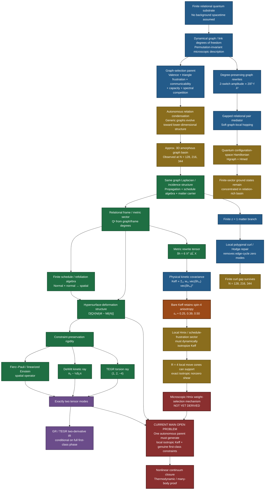

# GWXP — Finite Relational Quantum Structure and Emergent Gravity

> **Status: pre-handoff research candidate, not a completed theory.**  
> This repository freezes the strongest current version of GWXP as of **29 September 2026** so that graph theorists, mathematical physicists, quantum-gravity researchers, and many-body theorists can inspect, reproduce, attack, or falsify it.

GWXP asks whether a finite relational quantum system can have a low-energy phase in which an approximately three-dimensional geometry, local schedule/refoliation redundancy, two healthy tensor modes, and a common propagation/constraint metric emerge from one microscopic parent.

The project has **not** derived general relativity from finite information. It has accumulated a collection of exact finite constructions, numerical phase evidence, failed mechanisms, and explicit kill criteria that now reduce the remaining problem to a small number of difficult integration questions.

**New here?** Start with [`01) The Laymans Guide.md`](01%29%20The%20Laymans%20Guide.md) for the plain-English story, including the origin of the idea, what failed, what may be novel, and the speculative black-hole branch.


## GWXP at a glance



**Reading the diagram:** green/blue boxes are exact or analytically derived structures within GWXP; gold boxes are finite numerical evidence; purple boxes are conditional continuum conclusions. The orange box is an important negative result: the bare physical kinetic tensor remains rank-4 anisotropic. The red path is therefore the current handoff problem — deriving a genuinely microscopic local `H_mix` / schedule-frustration mechanism that isotropizes `K_eff`, and then proving that the resulting extended parent forms a first-class nonlinear gravitational phase.

## Current candidate

The frozen schematic parent is

```text
H_total = H_graph[A]
        + H_med[A, chi]
        + H_sched[B(A)]
        + H_mix[local Delta L statistics / schedule frustration]
        + H_matter[B(A), local cells].
```

The graph sector currently studied is

```text
H_graph = H_degree
        + tau T[A]
        - J Tr exp(g Atilde)
        + U sum_(ij in E) [exp(g Atilde)]_ij^2
        - kappa log det(epsilon I + Ltilde),
```

with the finite phase-search point

```text
d = 6
J = 1
g = 2.0
U = 0.100
kappa = 0.30
epsilon = 0.025
tau = 5
```

The corrected soft-local mediator is derived from a gapped pair sector. For a legal 2-switch

```text
(ab, cd) -> (ac, bd)
```

its effective Hermitian configuration-space hopping is

```text
t_GG' = -eta [
    R_G(a,c) R_G(b,d)
  + R_G'(a,b) R_G'(c,d)
],

R_G = (I - rho_m A_G)^(-1).
```

See [`docs/01) Frozen Candidate Parent - 2026-09-29.md`](docs/01%29%20Frozen%20Candidate%20Parent%20-%202026-09-29.md) for the precise frozen candidate and claim labels.

## What survived the final pre-handoff pass

| Test | Current status | Main result |
|---|---|---|
| Combined finite `H_graph + H_med` quantum sectors | **PASSED (finite sectors)** | Weak/moderate kinetic hopping does not eject the ground state from the relation-rich low-energy sector in tested exact configuration subspaces. |
| Autonomous graph phase, `N=128,216,344` | **STRONG NUMERICAL EVIDENCE** | Corrected coordinate-free states beat the broadened tested rank-1/2/3 Abelian/Cayley competitors at all three sizes. |
| Thermodynamic 3D stabilization | **OPEN** | Three sizes are encouraging but unequally relaxed; no asymptotic theorem or exponent claim is made. |
| Bare physical rank-4 kinetic isotropy | **FAILED** | Mediator-weighted whitened spin-4 residuals are approximately `0.249, 0.387, 0.499` for `N=128,216,344`. Amorphous disorder alone does not solve the tensor-isotropy problem. |
| Local `H_mix` isotropization | **VIABLE, NOT DERIVED** | Corrected `R=4` local move cones contain finite-strength exactly isotropic shear tensors, but the microscopic dynamics that naturally chooses the required weights is not yet derived. |
| Matter/Hodge curl repair | **PASSED at finite size** | Soft all-face penalties give nonzero curl gaps through `N=344`; a hard universal face cutoff is rejected. |
| Extended many-body first-class constraint phase | **OPEN** | Exact finite schedule/HDA-like constructions exist, but the full one-parent many-body integration theorem is not proved. |
| Nonlinear continuum GR/TEGR universality | **OPEN** | This remains a specialist-level endpoint, not a result of the present repository. |

The concise final-pass ledger is in [`docs/02) Pre-Handoff Final Pass - 2026-09-29.md`](docs/02%29%20Pre-Handoff%20Final%20Pass%20-%202026-09-29.md).

## Three-size autonomous ledger

At the same corrected graph couplings:

| `N` | autonomous `E/N` | best scanned rank-1/2/3 Abelian/Cayley `E/N` | `C4/N` | gap | `d_s(5)` | diameter |
|---:|---:|---:|---:|---:|---:|---:|
| 128 | -1.301651700 | -1.301602474 | 5.5313 | 0.15596 | 3.0365 | 6 |
| 216 | -1.302092376 | -1.301972547 | 4.9769 | 0.13505 | 3.2139 | 6 |
| 344 | -1.302342902 | -1.302071375 | 4.5436 | 0.13355 | 3.3669 | 7 |

These states are **not equally equilibrated**, so this table is phase evidence, not a thermodynamic scaling proof.

Raw summaries are in [`results/`](results/), and the authoritative state files are in [`data/states/`](data/states/).

## Most important negative result

The current project does **not** get isotropic graviton kinetics for free from amorphous geometry.

Using the exact metric-move identity

```text
6 X^T (Delta Ltilde_m) X = delta h_m
```

and the corrected mediator channel weights, the bare physical kinetic covariance remains strongly spin-4 anisotropic after whitening the rank-2 metric.

That means the `H_mix` / local schedule-frustration sector is not optional decoration. It must genuinely eliminate non-scalar rotational charge in the kinetic covariance.

This is now the cleanest technical handoff target:

> **Derive or refute a local microscopic schedule/frustration Hamiltonian whose low-energy measure drives the corrected mediator-weighted `K_eff` toward the isotropic spin-2 form without fitted global weights.**

## Exact / constructive structures already in the record

Conditional on the stated microscopic ingredients, the project contains exact or finite constructive results including:

- degree-sector valence selection;
- a universal leading degree-preserving 2-switch amplitude `20 Gamma^4/lambda^3`;
- finite schedule/refoliation commutators with the lapse wedge;
- the incidence identity `Bhat Bhat^T = Ltilde`;
- an exact finite `z=1` matter branch;
- moving-graph finite-rank `Delta L` identities and exact Jacobi checks;
- the metric-move identity linking graph rewrites directly to `K_eff`;
- Fierz-Pauli / linearized-Einstein rigidity under constraint preservation;
- DeWitt trace-coefficient rigidity;
- the TEGR coefficient ray under the stated degree-of-freedom conditions;
- a finite shared-clock coefficient lock between gravity and matter sectors.

For the full provenance, including killed routes and corrections, read [`03) Master Evidence Ledger - 2026-09-29.md`](03%29%20Master%20Evidence%20Ledger%20-%202026-09-29.md).

## Quick start

Tested environment:

```text
Python 3.13.5
NumPy 2.3.5
SciPy 1.17.0
```

Create an environment and run the lightweight repository verification:

```bash
python -m venv .venv
source .venv/bin/activate        # Windows: .venv\Scripts\activate
python -m pip install -r requirements.txt
python run_all_tests.py
```

`run_all_tests.py` checks the saved state integrity and verifies that the headline numerical claims in the repository match the stored results. It does **not** rerun the expensive searches.

See [`05) Reproducibility Guide.md`](05%29%20Reproducibility%20Guide.md) for commands that regenerate the main result families.

## Repository map

```text
README.md                         current public-facing summary
02) Project Status - 2026-09-29.md                         compact claim/status ledger
03) Master Evidence Ledger - 2026-09-29.md         full research history and evidence ledger
05) Reproducibility Guide.md                environment, commands, provenance
04) Known Issues and Corrections - 2026-09-29.md                   corrections, failed routes, unresolved weaknesses
07) Changelog - 2026-09-29.md                      dated changes in the final research pass
requirements.txt                  tested Python dependencies
run_all_tests.py                  lightweight stored-result verification

docs/
  01) Frozen Candidate Parent - 2026-09-29.md
  02) Pre-Handoff Final Pass - 2026-09-29.md
  03) Master Rollover - 2026-09-29.md
  04) Full Project History.md

data/
  states/                         authoritative corrected autonomous states
  legacy/                         explicitly non-authoritative historical/filtered states

results/                          saved JSON/NPZ outputs used by the final pass
scripts/                          final-pass numerical scripts
archive/                          earlier rollover/checkpoint packages for provenance
.github/                          issue templates and verification workflow
```

## Important methodological corrections preserved here

The repository deliberately retains the corrections rather than silently replacing them:

- earlier nominally “blind” `N=344` work used a hard radius-3 proposal filter and is not counted as autonomous emergence evidence;
- earlier nominal `k=3` moves included reducible `k=2 + spectator` cases;
- the old multiplicative common-graph mediator freezes too strongly with system size and is deprecated;
- the heuristic additive square-root mediator is not the derived microscopic kernel and is deprecated;
- zero-temperature downhill graph descent is an energy-landscape/accessibility diagnostic, not literal quantum evolution;
- the old claim that amorphous disorder self-isotropizes the physical rank-4 kinetic tensor is false on the corrected states;
- the old radius-3 `H_mix` success could exploit solutions that nearly turned off local shear and is therefore demoted;
- a universal hard face cutoff `ell <= 7` is false; the corrected matter sector uses a soft local loop hierarchy.

## What would falsify the programme

GWXP should be considered strongly damaged or killed if robust work establishes any of the following:

- no open coupling region supports a stable amorphous finite-dimensional phase below broad structured competitors;
- autonomous soft-local dynamics cannot access that phase as `N` grows;
- dimension/rank-4 observables drift away rather than stabilize;
- local `H_mix` requires nonlocal global coordination or cannot preserve a healthy nonzero shear sector;
- the matter curl gap collapses because local cell structure cannot remain finite-range/gapped;
- the finite schedule symmetry cannot become a genuine first-class local redundancy in the many-body low-energy space;
- extra scalar/vector modes remain gapless in the assembled parent;
- GR-like closure works only after inserting GR's continuum constraint tensors by hand.

A clean kill is preferable to adding rescue terms without derivation.

## Scope and caveats

This repository is **not peer reviewed**. It contains AI-assisted algebra, coding, numerical exploration, and research synthesis. Every derivation and numerical claim should be independently checked before publication or citation as an established result.

It does not claim:

- a proof of quantum gravity;
- a thermodynamic proof of emergent 3D space;
- complete nonlinear first-class closure;
- Standard Model emergence;
- a microscopic derivation of every coupling;
- that the universe literally implements this graph functional.

See [`04) Known Issues and Corrections - 2026-09-29.md`](04%29%20Known%20Issues%20and%20Corrections%20-%202026-09-29.md) and [`docs/01) Frozen Candidate Parent - 2026-09-29.md`](docs/01%29%20Frozen%20Candidate%20Parent%20-%202026-09-29.md) before interpreting any result.

## Contributing / attacking the model

The most useful contributions are adversarial:

- find a lower-energy structured graph family at the frozen couplings;
- reproduce or break the three-size phase ledger;
- derive the true thermodynamic behavior of the combined quantum graph Hamiltonian;
- construct or rule out a natural local `H_mix` that removes the physical spin-4 grain;
- prove or disprove an extended first-class constraint phase;
- find an extra gapless mode;
- expose any hidden coordinate, locality, or optimization bias.

Use the GitHub issue templates for reproducibility failures or theory challenges.

## License

No open-source license has been selected in this snapshot. See [`10) License Notice.md`](10%29%20License%20Notice.md) before public release.
